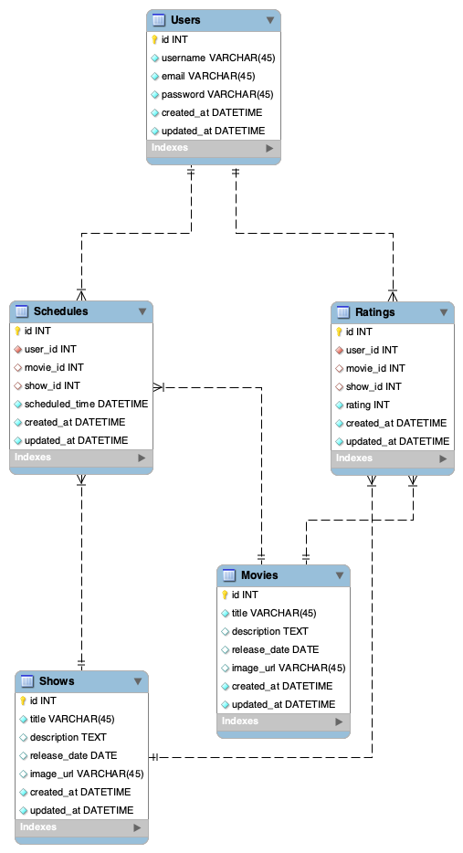

# Project: NextStream

## Overview
NextStream is a CRUD web application designed to help users easily find where their favourite movies and shows are being streamed based on their global location. It also offers personalized recommendations and advanced scheduling features, enabling users to effortlessly plan their perfect viewing experience, whether they're lounging or planning ahead. Users can create accounts, search for movies and shows, and delete schedules they no longer need. Say goodbye to the hassle of deciding what to watch at the last minute!

### Problem
With the proliferation of streaming services, users often face the challenge of finding where a particular movie or show is available to stream. Additionally, deciding what to watch next and keeping track of scheduled viewing can be time-consuming and overwhelming. Endless scrolling and searching through various platforms add to the frustration. NextStream addresses these issues by informing users where content is available to stream and helping them plan their viewing schedule in advance.

### User Profile

- **Streaming Enthusiasts**:
    - Looking for a streamlined way to find where their favourite content is available to watch.
    - Wanting personalized recommendations based on their viewing habits.
    - Needing a schedule to manage their viewing times efficiently.

- **Binge Watchers**:
    - Enjoy watching multiple episodes of a series in one sitting.
    - Want to keep track of where they left off and plan their next binge session.

- **Cinephiles**:
    - Passionate about movies and wanting to discover hidden gems and critically acclaimed films.
    - Interested in exploring new movies and revisiting classics.

- **Busy, Hard-Working Professionals**:
    - Seeking to unwind and relax with their favourite shows after a long day.
    - Prefer a hassle-free way to find and schedule their entertainment.

### Features

- **Global Location Streaming Information**:
    - As a user, I want to know where a movie or show is being streamed based on my global location.

- **Search Functionality**:
    - As a user, I want to be able to search for movies or shows and see where they are being streamed.

- **Recommendations**:
    - As a user, I want to receive personalized recommendations based on my viewing history and preferences.

- **Scheduling**:
    - As a user, I want to be able to schedule what shows or movies to watch and get reminders.

- **User Account Management**:
    - As a user, I want to be able to create an account to manage my scheduled shows and movies.
    - As a user, I want to be able to log in to my account to easily organize and enhance my viewing experience.

## Implementation

### Tech Stack

- **Frontend**:
    - React: For building reusable UI components and a dynamic user interface.
    - SASS: For flexible and maintainable styling.

- **Backend**:
    - Node.js: For scalable server-side scripting.
    - Express: For building the server and handling API requests.
    - MySQL: For robust and reliable data persistence.

- **Client Libraries**:
    - React: For managing the view layer and component lifecycle.
    - react-router: For handling client-side routing.
    - axios: For making HTTP requests to the backend API.

- **Server Libraries**:
    - express: For building the server and handling API requests.
    - knex: For managing the database and performing SQL queries.
    - bcrypt: For securing user passwords.

- **Tools**:
    - Jira: For project management and issue tracking.
    - Asana: For personal task management and organization.
    - Confluence: For personal documentation and whiteboarding.
    - Figma: For designing and prototyping user interfaces.

### Environmental Variables
- This project will use a `.env` file to manage environmental variables securely. A `.env.sample` file will be provided to illustrate the required variables and their formats, without exposing sensitive data. This file will be part of the final project submission.

### APIs and Integrations

- **TMDB API**:
    - Provides detailed information on movies and TV shows, including streaming provider data.

### Sitemap
- Home Page: Intro to the app and quick access to features.
- Search Results Page: Displays search results based on user input.
- Recommendations Page: Shows personalized recommendations.
- Schedule Page - Enable users to manage their viewing schedule with tabbed views for Calendar, Upcoming Movies/Shows, and Viewing History.
- Register Page - For user registration.
- Login Page - For user login.
- Profile Page - User profile information.

### Mockups

#### Home Page


#### Search Results Page


#### Recommendations Page


#### Schedule Page


#### Register Page


#### Login Page


#### Profile Page


### Data


### Endpoints

**User Management**

- **GET /users/profile**
    - Get the profile information of the logged-in user.

    - Parameters:
        - `userId`: ID of the logged-in user.
        - `token`: JWT token for authenticated requests.

    - Response:
    ```json
    {
        "userId": "1",
        "username": "user1_username",
        "email": "user_email",
        "scheduledMovies": [
            {
                "id": 1,
                "title": "Inception",
                "scheduledTime": "2024-06-01"
            }
        ]   
    }
    ```

- **POST /users/register**
    - Register a new user.

    - Parameters:
        - `email`: User's email.
        - `password`: User's provided password.
        - `username`: User's chosen username.

    - Response:
    ```json
    {
        "email": "user_email",
        "username": "user1_username"
    }
    ```

- **POST /users/login**
    - Log in a user.

    - Parameters:
        - `username`: User's chosen username.
        - `password`: User's provided password.

    - Response:
    ```json
    {
        "email": "user_email",
        "username": "user1_username"
    }
    ```

**Movie and Show Information**

- **GET /search**
    - Search for movies and shows based on user input.

    - Parameters:
        - `query`: search term provided by the user
        - `token`: JWT token for authenticated requests.

    - Response:
    ```json
    [
        {
            "id": 1,
            "title": "Inception",
            "streamingPlatforms": ["Netflix", "Amazon Prime"],
            "image": "inception.jpg"
        }
    ]
    ```

- **GET /movies/**
    - Get details of a specific movie or show.

    - Parameters:
        - `id`: ID of the movie or show.
        - `token`: JWT token for authenticated requests.

    - Response:
    ```json
    {
        "id": 1,
        "title": "Seinfeld",
        "description": "A show about nothing.",
        "releaseDate": "1989-07-05",
        "streamingPlatforms": ["Netflix", "Amazon Prime"],
        "image": "seinfeld.jpg",
        "rating": 8.9
    }
    ```

- **GET /high-rated**
    - Get a list of highly rated movies or shows.

    - Parameters:
        - `limit` (optional): Number of results to return (default is 3).
        - `token`: JWT token for authenticated requests.

    - Response:
    ```json
    {
        "id": 3,
        "title": "Inception",
        "rating": 9.0,
        "streamingPlatforms": ["Netflix", "Amazon Prime"],
        "image": "inception.jpg"
    }
    ```

- **GET /recommendations**
    - Get personalized recommendations for the user.

    - Parameters:
        - `userId`: ID of the logged-in user.
        - `token`: JWT token for authenticated requests.

    - Response:
    ```json
    [
        {
            "id": 2,
            "name": "Interstellar",
            "streamingPlatforms": ["Hulu"],
            "image": "interstellar.jpg"
        }
    ]
    ```

**Scheduling and Notifications**

- **POST /schedule**
    - Schedule a movie or show to watch.

    - Parameters:
        - `userId`: ID of the logged-in user.
        - `movieId`: ID of the movie or show.
        - `scheduledTime`: Time when the user plans to watch.

    - Response:
    ```json
    {
        "message": "Successfully scheduled"
    }
    ```

- **PUT /schedule/**
    - Update a scheduled movie or show.

    - Parameters:
        - `id`: ID of the scheduled entry.
        - `userId`: ID of the logged-in user.
        - `movieId`: ID of the movie or show.
        - `scheduledTime`: Updated time when the user plans to watch.

    - Response:
    ```json
    {
        "message": "Schedule updated successfully"
    }
    ```

- **DELETE /schedule/**
    - Delete a scheduled movie or show.

    - Parameters:
        - `id`: ID of the scheduled entry.
        - `userId`: ID of the logged-in user.

    - Response:
    ```json
    {
        "message": "Schedule deleted successfully"
    }
    ```

**User Interaction**

- **GET /history**
    - Get the viewing history of the logged-in user.

    - Parameters:
        - `userId`: ID of the logged-in user.
        - `token`: JWT token for authenticated requests.

    - Response:
    ```json
    [
        {
            "id": 1,
            "title": "Inception",
            "viewedOn": "2024-06-01",
            "rating": 9.0
        }
    ]
    ```

- **POST /ratings**
    - Submit a rating for a movie or show.

    - Parameters:
        - `userId`: ID of the logged-in user.
        - `movieId`: ID of the movie or show.
        - `rating`: Rating given by the user.
        - `token`: JWT token for authenticated requests.

    - Response:
    ```json
    {
        "message": "Rating submitted successfully"
    }
    ```

### Auth

- **JWT Auth**:
    - Initially, all API requests will use a fake user with ID 1. 
    - JWT authentication will be added after the core features are implemented.
    - Store JWT in cookies and session storage and remove it on logout.
    - Use JWT for user-specific actions like scheduling and recommendations.
    - Add states for logged-in users to show different UI elements as specified in the mockups.

## Roadmap

### Milestones
- [x] Create project proposal
- [x] Set up project repository
- [x] Implement initial features

- **Initialize Client**:
    - Set up the React project with necessary routes and initial structure.
    - Implement basic components and layout to serve as the foundation for the application.

- **Initialize Server**:
    - Set up the Express server with initial routing.
    - Implement placeholder routes returning status 200 for initial endpoints.
    - Integrate error handling to manage potential issues and improve debugging during development.

- **Create Database**:
    - Set up MySQL and create the required tables.
    - Design and implement the data schema to support user accounts, movie/show data, and scheduling.

- **Feature: Global Location Streaming Information**
    - Develop the search page to display streaming availability based on the user's global location.
    - Create the `GET /search` endpoint to fetch relevant data from TMDB API.

- **Feature: Recommendations**
    - Implement the recommendations page to show personalized suggestions.
    - Create the `GET /recommendations` endpoint.

- **Feature: Scheduling**
    - Develop the schedule page where users can plan their viewing times.
    - Implement the `POST /schedule` endpoint to save user schedules.

- **Feature: User Authentication**
    - Develop the registration and login pages to manage user accounts:
        - Implement `POST /users/register` and `POST /users/login` endpoints, requiring both email and username for login.
    - Server:
        - Utilize JWT for secure authentication.
        - Update expected requests/responses on protected endpoints.
    - Client:
        - Store JWT in `cookies`.
        - Include JWT in `axios` calls to secure endpoints.
        - Ensure secure access to protected endpoints.
    
- **Testing**:
    - Write unit tests to ensure individual components and functions work as expected.
    - Implement integration tests to verify that different parts of the application work together seamlessly.

- **Deployment**:
    - Deploy the client and server to a hosting platform.
    - Ensure continuous deployment and integration to promptly reflect changes in the production environment.

- **Bug Fixes**:
    - Address any issues identified during testing or reported by users.
    - Continuously improve the application to ensure a smooth user experience.

- **Demo Day**:
    - Prepare a comprehensive presentation for the final demonstration.
    - Highlight key features and provide a live demo to showcase the application's capabilities.

## Nice-to-haves

- **Calendar Integration**:
    - Enable users to sync their viewing schedules with Google Calendar or Apple Calendar.

- **Enhanced Recommendations**:
    - Implement advanced machine learning techniques to provide more accurate recommendations based on user behaviour.

- **Social Features**:
    - Allow users to share their shows or movies and recommendations with friends.

- **Voice Recognition Integration**:
    - Integrate voice recognition software like Google Assistant, Siri, or Alexa to allow users to search and schedule movies or shows using voice commands.

## Next Steps

- Continue refining the recommendation algorithm to improve accuracy.
- Explore additional notification options, such as email reminders.
- Implement social features to enhance user interaction.
- Optimize performance and scalability for handling a larger user base.

## Lessons Learned:
- Importance of clear API documentation for seamless integration.
- Challenges of implementing cookies and session storage authentication and handling user sessions.
- Integrating multiple APIs to provide a cohesive user experience.

## Installation Instructions:
- **Follow these steps to set up the NextStream application on your local development environment**:

### Prerequisites
- **Ensure you have the following installed on your machine**:
    - Node.js (v14 or later)
    - npm (v6 or later) or Yarn (v1.22 or later)
    - MySQL (v8 or later)

### Installing Node.js and npm
- **You can download and install Node.js and npm from the official website**: 
    - [Visit Node.js Website](https://nodejs.org/en)

- **Alternatively, use a package manager**:

#### On macOS:
- **Using Homebrew**: 
    - brew install node

- **On Ubuntu/Debian**:
    - sudo apt update
    - sudo apt install nodejs npm

### Installing MySQL

#### On macOS:
- **Using Homebrew**: 
    - brew install mysql
    - brew services start mysql

- **On Ubuntu/Debian**:
    - sudo apt update
    - sudo apt install mysql-server
    - sudo systemctl start mysql
    - sudo systemctl enable mysql

#### On Windows:
- **Download the MySQL installer from the official website**:
    - [MySQL's Website](https://dev.mysql.com/downloads/installer/)

- **Clone the Repository**: 
    - git clone https://github.com/sunshineagoo17/nextstream.git
    - cd nextstream

- **Install Dependencies**:
    - Install the server-side dependencies:
        - cd server
        - npm install
        or
        - yarn install

    - Install the client-side dependencies:
        - cd ../client
        - npm install
        or
        - yarn install

- **Set Up the Environment Variables**:
    - Create a `.env` file in the root directory of both the `server` and `client` folders, based on the `.env.sample` provided. Fill in the necessary values for your local environment.
    - For the server (`server/.env`):
        - PORT=8080
        DB_HOST=localhost
        DB_USER=root
        DB_PASSWORD=yourpassword
        DB_NAME=nextstream
        
        - JWT_SECRET=your_jwt_secret
        - SENDGRID_API_KEY=your_sendgrid_api_key
        - TMDB_API_KEY=your_tmdb_api_key
    
    - For the client (`client/.env`):
        - REACT_APP_API_URL=http://localhost:8080

    - Note: You will need to sign up for SendGrid and TMDB to obtain your API keys. Visit the following links to sign up:
        - [SendGrid](https://sendgrid.com/)
        - [TMDB](https://www.themoviedb.org/)

- **Set Up the Database**:
    - Start MySQL and create a database named `nextstream`:
        - CREATE DATABASE nextstream;
    
    - Run the database migrations to set up the necessary tables:
        - cd server
        - npx knex migrate:latest
        - npx knex seed:run

- **Start the Development Servers**:
    - Start the server:
        - cd server
        npm start
        or
        yarn start

    - Start the client:
        - cd ../client
        npm start
        or 
        yarn start

- **Access the Application**:
    - Open your browser and navigate to `http://localhost:3000` to access the NextStream application.